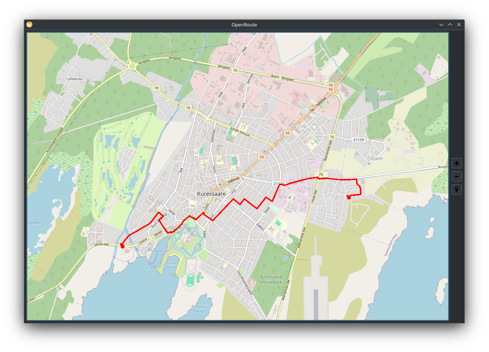

# OpenRoute
This project allows you to use OSM data to display maps on desktop without internet connection and build routes between points on map that you choose.

To be able to use this project you need to follow instructions below to set up database.
# Setting up database
## Create database

    sudo -u postgres -i
    createuser mapper
    createdb -E UTF8 -O mapper gis
    psql -c "CREATE EXTENSION postgis; CREATE EXTENSION hstore; CREATE EXTENSION pgrouting;" -d gis

## Import OSM data

    osm2pgsql -d gis --hstore --tag-transform-script <path_to_openstreetmap-carto>/openstreetmap-carto.lua --style <path_to_openstreetmap-carto>/openstreetmap-carto.style <path_to_osm_data>/.osm.pbf

## Create road graph

    psql -c "CREATE TABLE tmp_edges AS SELECT osm_id as id, way AS geom FROM planet_osm_line WHERE highway IS NOT NULL AND way IS NOT NULL;" -d gis
    psql -c "ALTER TABLE tmp_edges ADD COLUMN source integer; ALTER TABLE tmp_edges ADD COLUMN target integer;" -d gis

    psql -c "SELECT pgr_nodeNetwork('tmp_edges', 0.0001, 'id', 'geom');" -d gis
    psql -c "DROP TABLE tmp_edges;" -d gis
    psql -c "ALTER TABLE tmp_edges_noded RENAME TO roads;" -d gis

    psql -c "SELECT pgr_createTopology('roads', 0.00001, 'geom');" -d gis
    psql -c "ALTER TABLE roads ADD COLUMN length double precision; UPDATE roads SET length = ST_Length(geom);" -d gis

## Create mapnik styles
go into lib directory

    git clone https://github.com/gravitystorm/openstreetmap-carto
    cd openstreetmap-carto
    python -m venv venv
    source ./venv/bin/activate

    pip install pyyaml && pip install requests && pip install psycopg2
    sudo -u postgres -i
    ./scripts/get-external-data.py

Add this strings into project.mml file in _parts: section

host: "127.0.0.1"

port: "5432"

user: "mapper"

    carto project.mml > mapnik.xml

    psql -c "GRANT ALL PRIVILEGES ON ALL TABLES IN SCHEMA public TO mapper;" -d gis

# Dependencies

 - mapnik => 3.1.0-22
 - qt6
